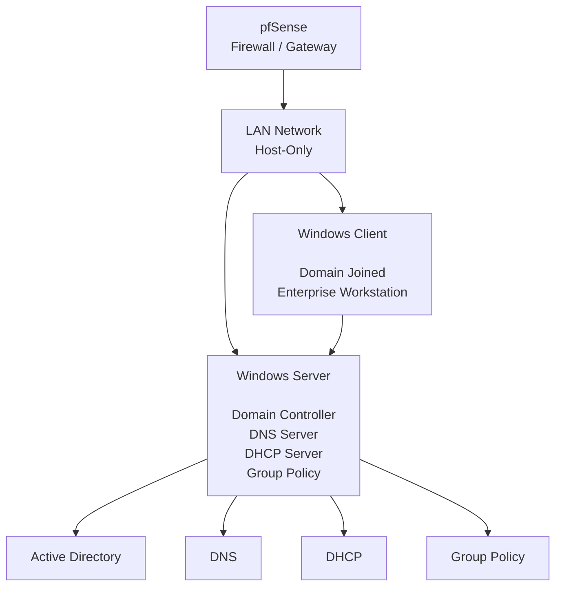

# Windows Server

## Overview

This section documents the deployment and configuration of **Windows Server** as the core infrastructure server for the Enterprise Infrastructure Lab.

The objective is to simulate a small enterprise environment by implementing centralized identity management, name resolution, IP address management and administrative policy enforcement.

---

## Objectives

- Deploy Windows Server in the lab environment
- Configure static IPv4 networking
- Install and configure Active Directory Domain Services
- Promote the server to a Domain Controller
- Configure DNS services
- Configure DHCP services
- Create Organizational Units (OUs)
- Create users and groups
- Configure Group Policy Objects (GPOs)
- Join a Windows Client to the domain
- Document the complete Windows Server configuration

---

## Windows Server Architecture

## Configuration Sections

- VM Installation and Configuration
- Static IPv4 Configuration
- Active Directory Domain Services
- Domain Controller Promotion
- DNS Configuration
- DHCP Configuration
- Organizational Units
- Users and Groups
- Group Policy Objects
- Windows Client Domain Join

---

## Folder Structure

01-Windows-Server/
├── README.md
├── Screenshots/
│   └── Deployment and configuration screenshots
└── configs/
    ├── VM-Configuration.md
    └── Windows-Server-Configuration.md

---
