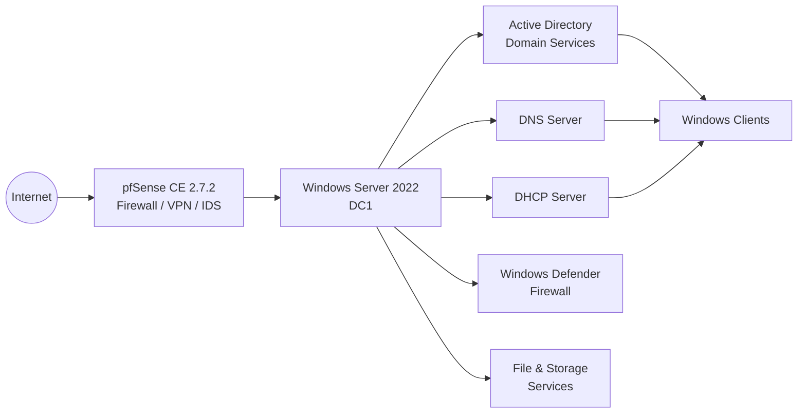

# Windows Server

## Overview

This section documents the deployment and configuration of **Microsoft Windows Server 2022** as the core infrastructure server for the Enterprise Infrastructure Lab.

The server provides centralized authentication, directory services, name resolution, dynamic IP address allocation and storage services for the laboratory environment, integrating with the pfSense firewall and future Windows domain clients.

---

## Infrastructure Overview



---

## Objectives

- Deploy Microsoft Windows Server 2022
- Configure a static IPv4 address
- Deploy Active Directory Domain Services (AD DS)
- Promote the server to a Domain Controller
- Configure DNS Server
- Configure DHCP Server
- Configure Windows Defender Firewall
- Prepare the environment for Windows domain clients
- Document the complete infrastructure
  
---


## Implemented Services

| Service | Status |
|----------|:------:|
| Windows Server 2022 | ✅ |
| Static IPv4 Configuration | ✅ |
| Active Directory Domain Services | ✅ |
| Domain Controller | ✅ |
| DNS Server | ✅ |
| DHCP Server | ✅ |
| Windows Defender Firewall | ✅ |
| File & Storage Services | ✅ |

---


## Folder Structure

```text
01-Windows-Server/
├── README.md
├── Screenshots/
│   └── Deployment and configuration screenshots
└── configs/
    ├── VM-Configuration.md
    └── Windows-Server-Configuration.md
```

---
