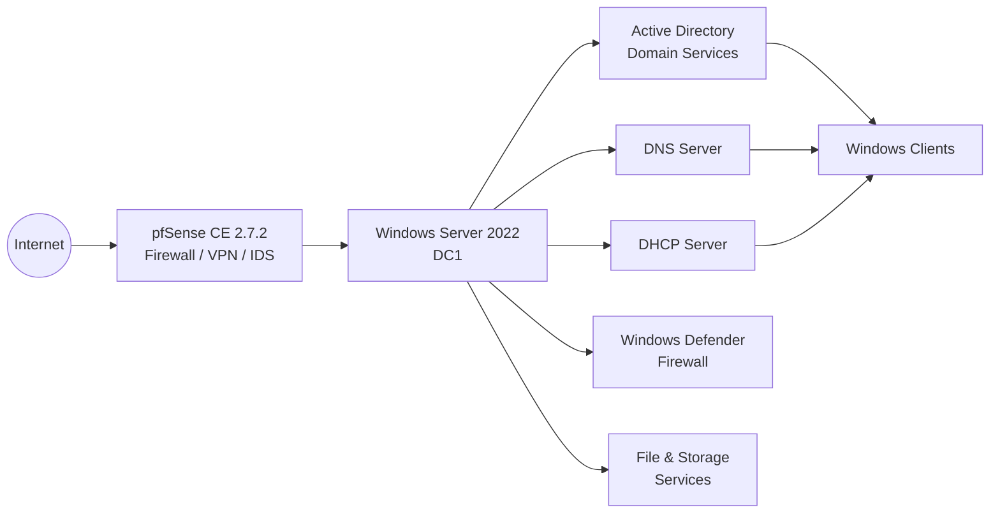

# Windows Server

## Overview

This section documents the deployment and configuration of Microsoft Windows Server 2022 as the core infrastructure server for the Enterprise Infrastructure Lab.

The server provides centralized authentication, directory services, DNS name resolution, DHCP-based IP address allocation and file services for the laboratory environment. It integrates with the pfSense firewall and serves as the central infrastructure platform for Windows domain clients.

---

## Infrastructure Overview



---

## Objectives

| Objective | Description |
|-----------|-------------|
| Windows Server Deployment | Deploy Microsoft Windows Server 2022 |
| Static Networking | Configure a static IPv4 address |
| Active Directory | Deploy Active Directory Domain Services (AD DS) |
| Domain Controller | Promote the server to a Domain Controller |
| DNS | Configure the DNS Server role |
| DHCP | Configure the DHCP Server role |
| Windows Defender Firewall | Configure the Windows Defender Firewall |
| Domain Infrastructure | Prepare the environment for Windows domain clients |
| Documentation | Document the complete infrastructure |

  
---


## Implemented Services

| Service | Status |
|----------|:------:|
| Windows Server 2022 | ✅ |
| Static IPv4 Configuration | ✅ |
| Active Directory Domain Services | ✅ |
| Domain Controller | ✅ |
| DNS Server | ✅ |
| DHCP Server | ✅ |
| Windows Defender Firewall | ✅ |
| File & Storage Services | ✅ |

---


## Folder Structure

```text
01-Windows-Server/
├── README.md
├── Screenshots/
│   └── Deployment and configuration screenshots
└── configs/
    ├── VM-Configuration.md
    └── Windows-Server-Configuration.md
```

---
