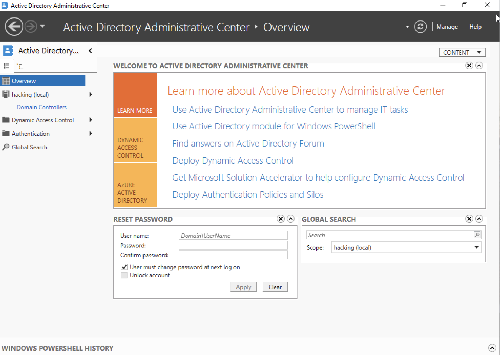
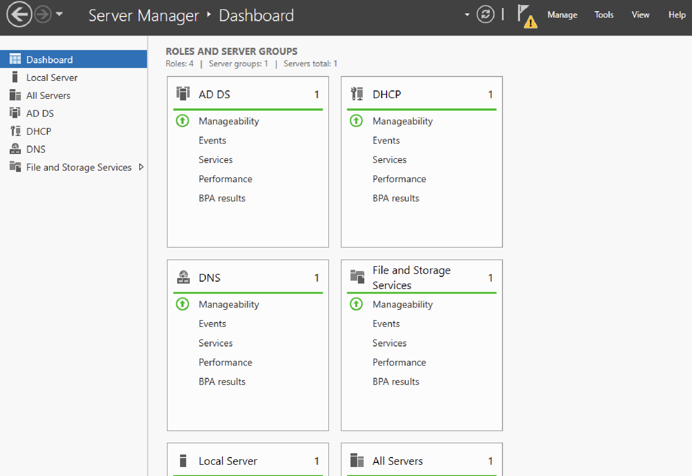
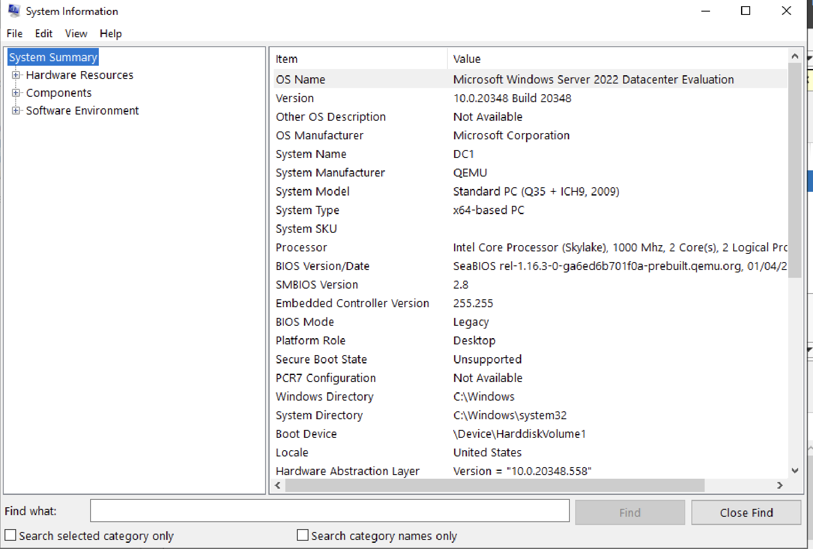
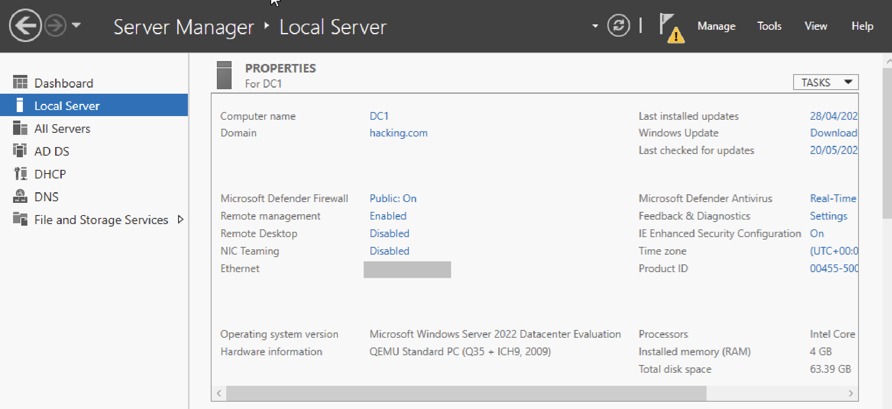
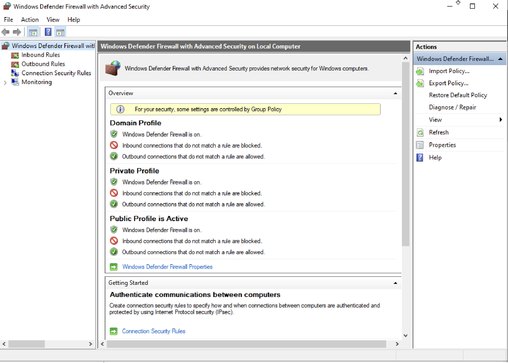
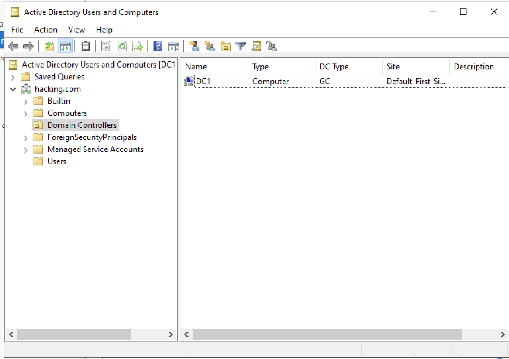
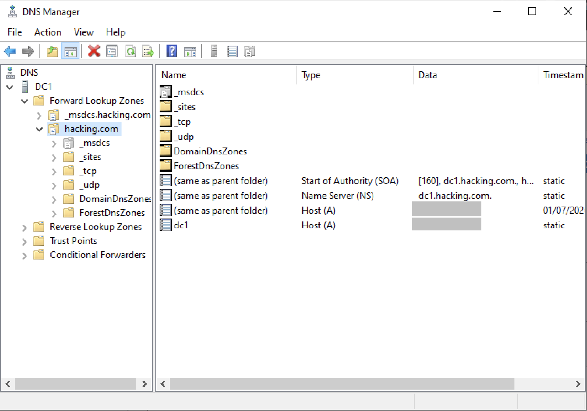
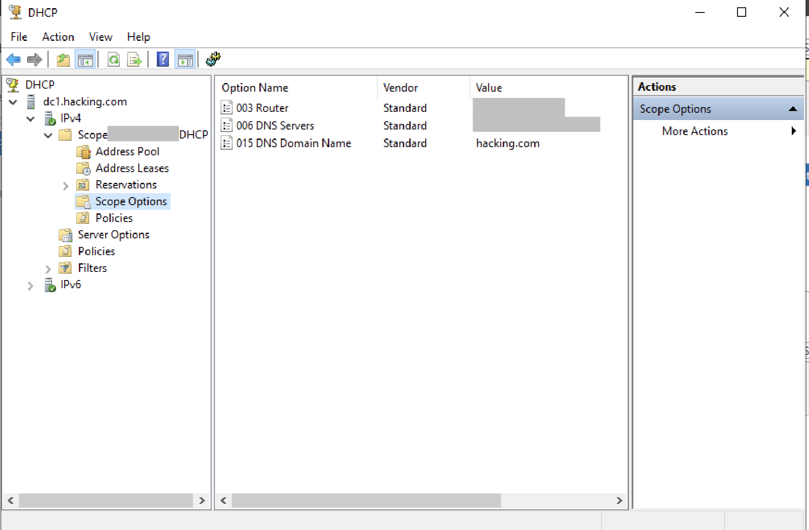

# Windows Server 2022 - Configuration

This document describes the configuration implemented on **Microsoft Windows Server 2022 Datacenter Evaluation** as the central identity, DNS and DHCP server for the Enterprise Infrastructure Lab.

---

# Active Directory Administrative Center

The Active Directory Administrative Center provides the modern administrative interface used to manage the Active Directory environment.

Main features:

- User Management
- Group Management
- Password Reset
- Global Search
- Domain Administration

---

# Server Manager Dashboard

The Server Manager dashboard provides a centralized view of all installed roles and services running on the server.

Installed roles:

| Role | Purpose |
|------|---------|
| Active Directory Domain Services | Identity and authentication |
| DNS Server | Name resolution |
| DHCP Server | Dynamic IP allocation |
| File and Storage Services | Storage management |

---

# System Information

The following screenshot shows the deployed Windows Server version together with the hardware allocated to the virtual machine.

| Component | Value |
|-----------|-------|
| Operating System | Windows Server 2022 Datacenter Evaluation |
| Hostname | DC1 |
| Virtualization | QEMU |
| CPU | 2 vCPU |
| Memory | 4 GB RAM |
| Storage | 64 GB |

---

# Local Server Configuration

The Local Server console summarizes the core operating system configuration.

Configuration:

- Hostname configured
- Domain joined
- Windows Defender Firewall enabled
- Remote Management enabled
- Remote Desktop disabled
- Static IPv4 configuration
- Windows Defender Antivirus enabled

---

# Windows Defender Firewall

Windows Defender Firewall provides the first layer of protection for the Windows Server.

Configuration:

- Domain Profile enabled
- Private Profile enabled
- Public Profile enabled
- Inbound traffic restricted
- Outbound traffic allowed
- Group Policy managed configuration

---

# Active Directory Users and Computers

Active Directory Users and Computers (ADUC) provides the classic administrative interface used to manage the Active Directory objects.

Managed objects include:

- Domain Controllers
- Users
- Groups
- Computers
- Organizational Units
- Security Principals

---

# DNS Server

The DNS Server is integrated with Active Directory and provides internal name resolution for the laboratory environment.

Configuration:

- Active Directory Integrated Zone
- Forward Lookup Zone
- SOA Record
- NS Record
- Host (A) Records
- Automatic Active Directory registration

---

# DHCP Server

The DHCP Server automatically provides network configuration to all internal clients.

Scope configuration:

| Option | Purpose |
|---------|---------|
| Router | Default Gateway |
| DNS Server | Internal DNS Resolution |
| DNS Domain Name | Active Directory Domain |

Features:

- IPv4 Scope
- Address Pool
- Address Leases
- Reservations
- Scope Options
- DHCP Policies

---

# Windows Server Roles Summary

| Role | Status |
|---------|--------|
| Active Directory Domain Services | ✅ Operational |
| Domain Controller | ✅ Operational |
| DNS Server | ✅ Operational |
| DHCP Server | ✅ Operational |
| Windows Defender Firewall | ✅ Enabled |
| File and Storage Services | ✅ Operational |
| Remote Management | ✅ Enabled |
| Remote Desktop | ❌ Disabled |

---

# Security Configuration

The Windows Server has been configured following basic security best practices.

Implemented security controls:

- Windows Defender Firewall enabled
- Windows Defender Antivirus enabled
- Static IP configuration
- Domain-based authentication
- Active Directory integrated DNS
- Centralized DHCP management
- Remote Desktop disabled
- Remote Management enabled

---
