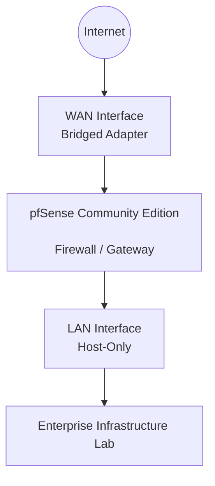

# pfSense Firewall

## Overview

This section documents the deployment and configuration of **pfSense Community Edition** as the perimeter firewall for the Enterprise Infrastructure Lab.

The objective is to simulate a small enterprise environment by implementing secure network connectivity, traffic filtering, network segmentation and remote administration using industry-standard firewall practices.

---

## pfSense Architecture


---


## Objectives

| Objective | Description |
|-----------|-------------|
| Deploy pfSense | Deploy pfSense Community Edition as the perimeter firewall |
| Network Configuration | Configure WAN and LAN interfaces |
| IPv4 Networking | Configure IPv4 addressing |
| Firewall | Implement firewall rules |
| OpenVPN | Configure remote VPN access |
| Certificate Authority | Create an internal CA |
| Squid Proxy | Deploy transparent web proxy |
| SquidGuard | Configure URL filtering |
| Snort IDS/IPS | Deploy intrusion detection and prevention |
| Documentation | Document the complete firewall configuration |

---

## Configuration Sections

| Section | Description |
|---------|-------------|
| VM Installation | Virtual machine deployment and initial configuration |
| WAN Configuration | Internet-facing interface configuration |
| LAN Configuration | Internal network configuration |
| Firewall Rules | Inbound and outbound filtering policies |
| Certificate Authority | Internal PKI configuration |
| OpenVPN | Remote access VPN configuration |
| Squid Proxy | Transparent web proxy configuration |
| SquidGuard | URL filtering configuration |
| Snort IDS/IPS | Intrusion detection and prevention configuration |

---

## Folder Structure

```text
03-Network-Security-pfSense/
├── README.md
├── Screenshots/
│   └── Deployment and configuration screenshots
└── configs/
    ├── VM-Configuration.md
    └── pfSense-Configuration.md
```

---


