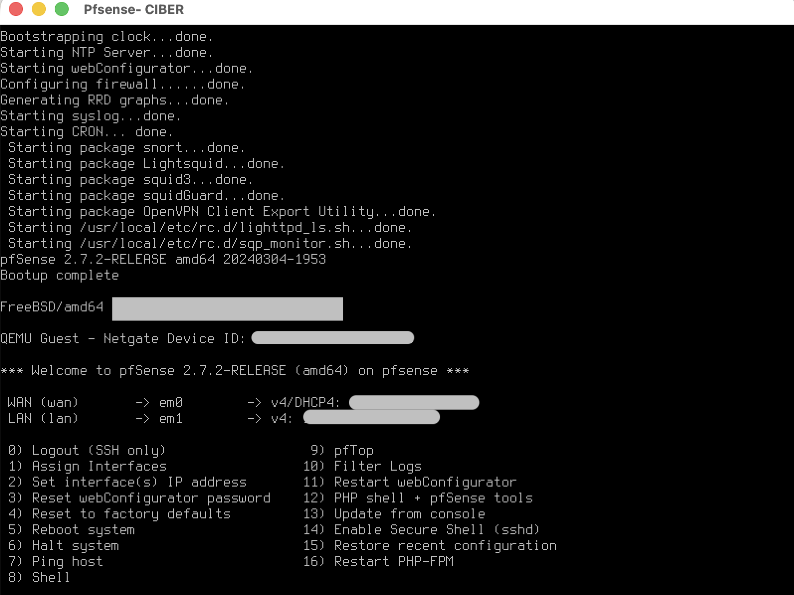
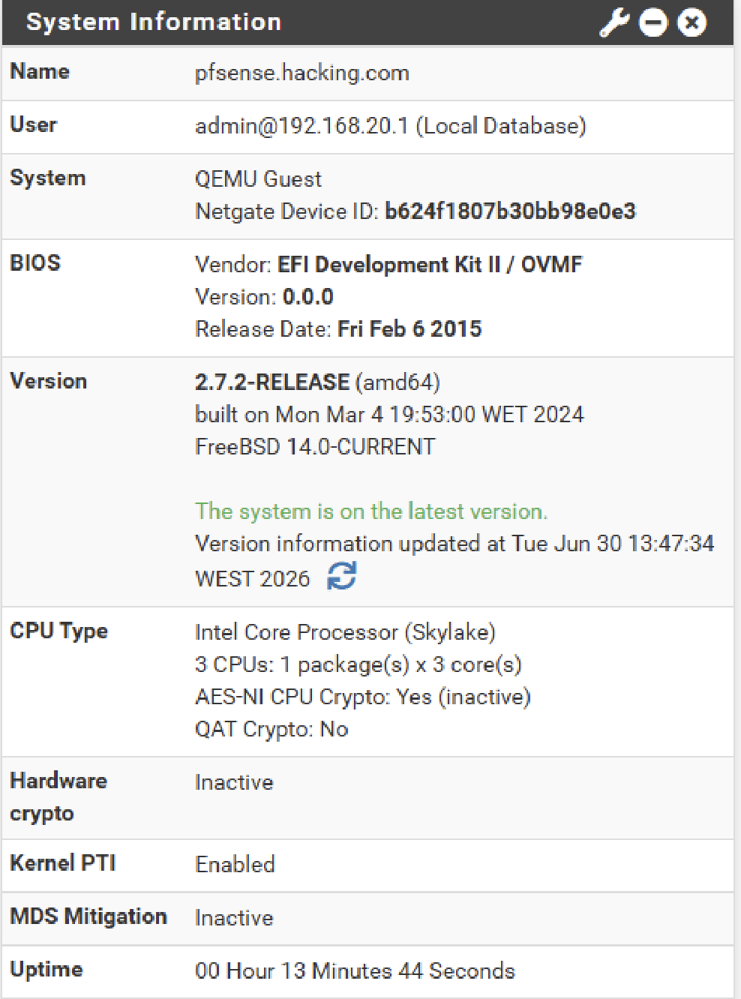
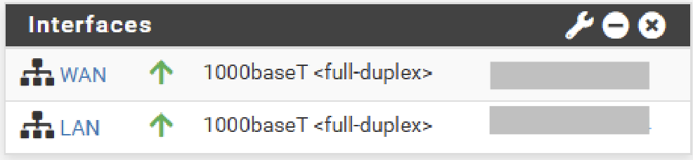
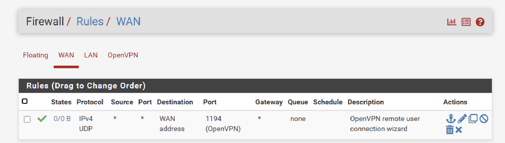
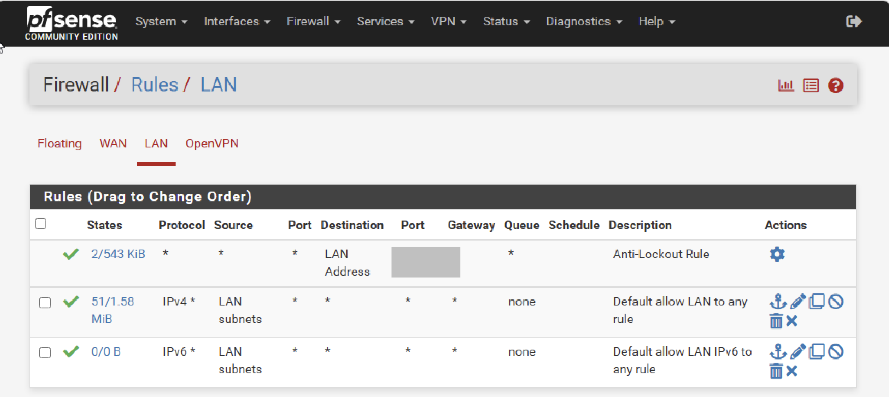
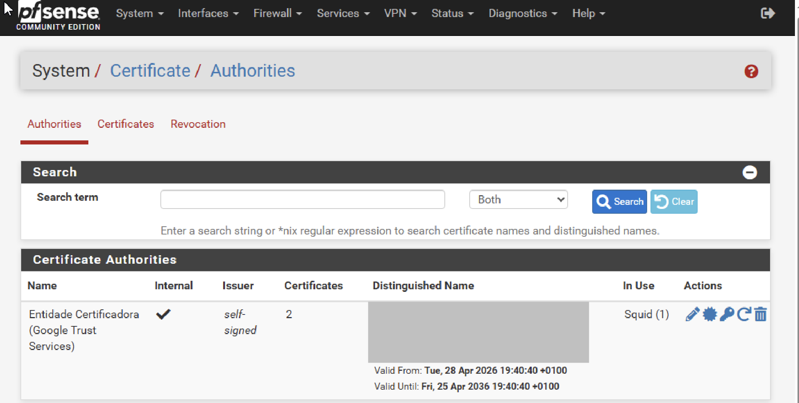
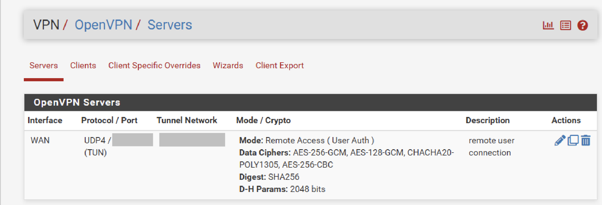
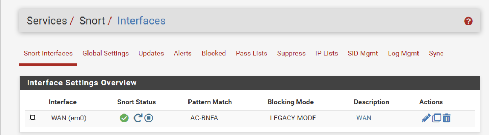
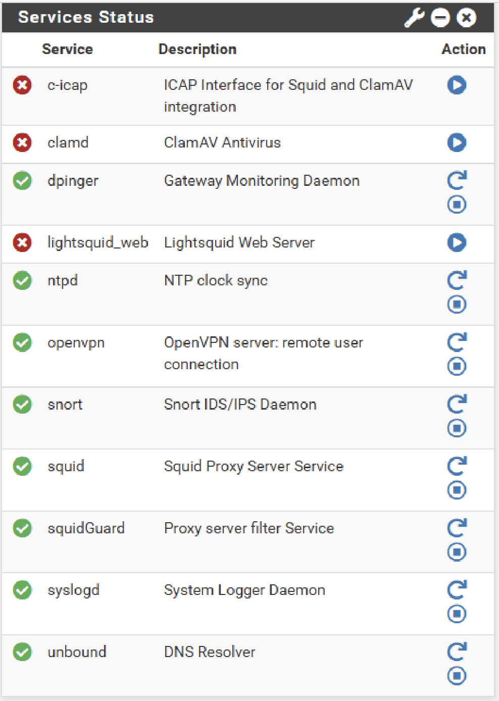

# pfSense Community Edition - Configuration

This document describes the configuration implemented on **pfSense Community Edition 2.7.2** as the perimeter firewall and network gateway for the Enterprise Infrastructure Lab.

---

# System Overview

---

# System Information

The following screenshot shows the deployed firewall version and hardware information.

---

# Network Interfaces

Two interfaces were configured.

| Interface | IP Assignment | Purpose |
|------------|--------------|---------|
| WAN | DHCP | Internet connectivity |
| LAN | Static | Enterprise internal network |

---

## WAN Configuration

The WAN interface is configured in **DHCP mode** using a **Bridged Adapter**, allowing the firewall to obtain an IPv4 address from the external network.

| Configuration | Value |
|---------------|-------|
| IPv4 Configuration | DHCP |
| Network Adapter | Bridged |
| Interface | WAN |
| Purpose | Internet Connectivity |

---

## LAN Configuration

The LAN interface provides the internal enterprise network used by the laboratory virtual machines.

| Configuration | Value |
|---------------|-------|
| DHCP Server | Disabled (provided by Windows Server) |
| IPv4 Configuration | Static IPv4 |
| Default Gateway | Configured for internal hosts |

---

# Firewall Rules

## WAN

Only the OpenVPN service is exposed externally.

| Rule | Protocol | Port | Purpose |
|------|----------|------|---------|
| Allow | UDP | 1194 | OpenVPN Remote Access |
| Default Policy | Any | Any | Deny all other inbound traffic |

---

## LAN

Internal clients are allowed outbound connectivity.

| Rule | Source | Destination | Purpose |
|------|--------|-------------|---------|
| Allow | LAN | Any | Allow outbound traffic |
| Anti-Lockout | LAN | Firewall | Prevent administrative lockout |

---

# Certificate Authority

An internal Certificate Authority (CA) was created for OpenVPN certificate authentication.

---

# OpenVPN

OpenVPN was configured to provide secure remote access to the Enterprise Infrastructure Lab using certificate-based authentication over UDP.

---

# Squid Proxy

Squid was configured as a transparent proxy to monitor and control web traffic generated by internal clients.

| Configuration | Value |
|---------------|-------|
| Proxy Mode | Transparent HTTP Proxy |
| HTTPS Inspection | Enabled |
| Certificate Authority | Internal CA |
| Listening Mode | IPv4 |
| LAN Interface | Enabled |
| SSL Bump | Enabled |
| HTTPS Interception | Enabled |
| Internal Bypass Rules | Configured |
# Snort IDS/IPS

Snort was deployed as the Intrusion Detection and Prevention System (IDS/IPS) for the enterprise network.
It is prepared for integration with Wazuh SIEM to provide centralized alert management and security monitoring.

---

# Service Status

The following table summarizes the operational status of the main pfSense services configured in this laboratory.

| Feature | Status |
|---------|--------|
| WAN Interface | ✅ Configured |
| LAN Interface | ✅ Configured |
| NAT | ✅ Enabled |
| Firewall | ✅ Configured |
| OpenVPN | ✅ Operational |
| Certificate Authority | ✅ Created |
| Squid | ✅ Operational |
| SquidGuard | ✅ Operational |
| Snort IDS/IPS | ✅ Operational |
| IPv6 | ❌ Disabled |

The screenshot below confirms the runtime status of the deployed services.

> **Note:** Optional services such as ClamAV, c-icap and Lightsquid were not configured as they are outside the scope of this project.

---

