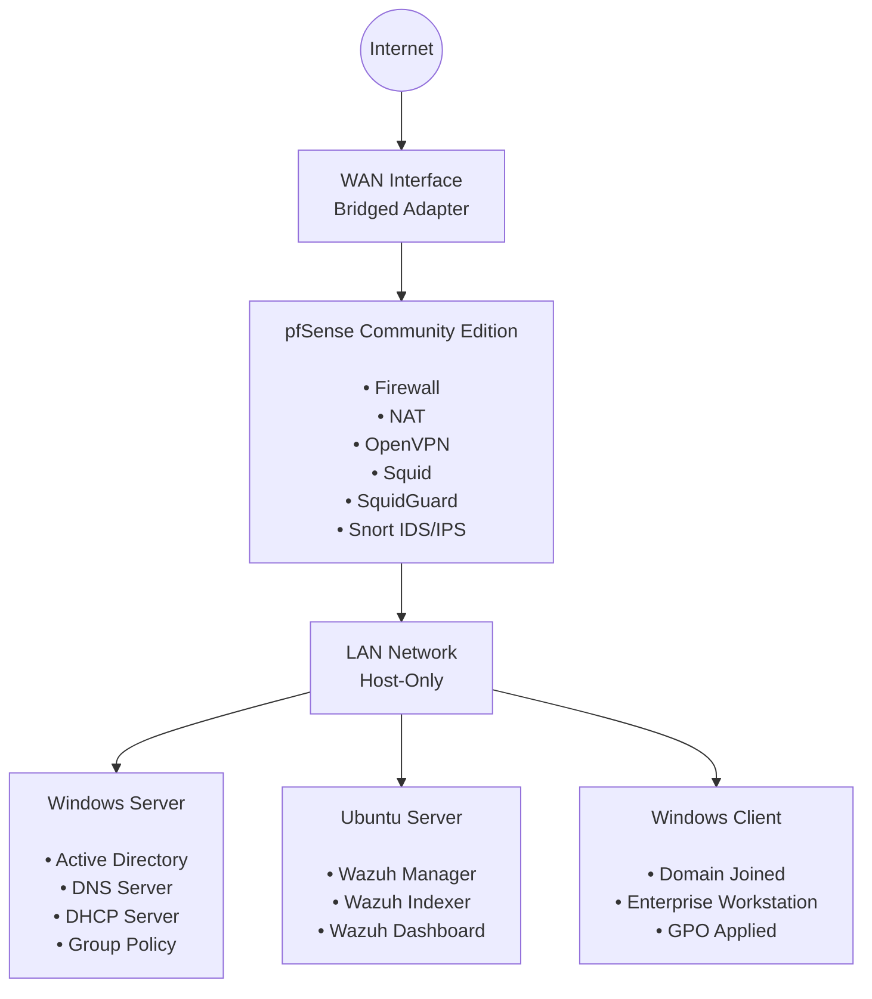

# Enterprise-Infrastructure-Lab

<div align="center">

# 🏗️ Enterprise Infrastructure & Security Lab

### Systems Integration • Networking • Cybersecurity • Infrastructure Engineering

[]
[]
[]
[]
[]


---

Design, deployment and documentation of a complete enterprise infrastructure laboratory focused on **Systems Integration**, **Networking**, **Cybersecurity** and **Infrastructure Engineering**.

</div>

---

## Project Overview

This project is part of my **Enterprise Infrastructure Lab**, a virtual enterprise environment built using **UTM on macOS**.

The laboratory demonstrates the deployment and integration of enterprise networking, Windows infrastructure, Security Information and Event Management (SIEM) technologies.

The environment consists of:

- **pfSense Community Edition** – Firewall, gateway, NAT, OpenVPN, Squid Proxy, SquidGuard and Snort IDS/IPS.
- **Windows Server** – Active Directory, DNS, DHCP, Group Policy and centralized identity management.
- **Ubuntu Server** – Wazuh SIEM for centralized log collection, event correlation, security monitoring and alerting.
  
---

> [!NOTE]
> For privacy and security reasons, sensitive network information such as IP addresses, MAC addresses, hostnames and other identifiers may be intentionally hidden or anonymized in screenshots and configuration examples.
>
> Any values shown are for documentation purposes only and do **not** represent my personal or home network.

---

# 🎯 Objectives

- Design an enterprise network architecture
- Deploy and configure pfSense Firewall
- Configure Windows Server infrastructure
- Implement Active Directory, DNS and DHCP
- Deploy Ubuntu Server services
- Implement SIEM monitoring using Wazuh
- Configure IDS/IPS with Snort
- Practice troubleshooting and systems integration
- Enterprise Documentation

---

## Lab Architecture



---

# ⚙️ Technologies

| Category | Technologies |
|----------|--------------|
| Firewall | pfSense |
| IDS/IPS | Snort |
| SIEM | Wazuh |
| Virtualization | UTM |
| Windows Infrastructure | Active Directory, DNS, DHCP |
| Linux | Ubuntu Server |
| Containers | Docker |
| Security Testing | Nmap |

---

# 📂 Repository Structure

```
01-windows-server/
02-wazuh-siem/
03-network-security-pfsense/
04-validation/


